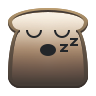

[](https://binary-factory.kde.org/job/SnoreToast_Nightly_win64)


Snoretoast
==========
A command line application capable of creating Windows Toast notifications on Windows 8 or later.
If SnoreToast is used without the parameter --appID an default appID is used and a shortcut to SnoreToast.exe is created in the startmenu, notifications created that way will be asigned to SnoreToast.

If you want to brand your notifications you need to create the application startmenu entry with `snoretoast.exe --install "MyApp\MyApp.lnk" "C:\myApp.exe" "My.APP_ID"`.
This appID then needs to be passed to snoretoast.exe with the `--appID`` parameter.

# Releases and Binaries
[Get releases and binaries](https://download.kde.org/stable/snoretoast/)

[Get the latest nightly](https://binary-factory.kde.org/job/SnoreToast_Nightly_win64)

# Contact us
- [Report Bugs](https://bugs.kde.org/enter_bug.cgi?product=Snoretoast)
- [Find us on Irc](https://web.libera.chat/?channels=#kde-windows)
- [Send us a mail](mailto:kde-windows@kde.org)

----------------------------------------------------------
```
Welcome to SnoreToast 0.7.0.
A command line application capable of creating Windows Toast notifications.

---- Usage ----
SnoreToast [Options]

---- Options ----
[-t] <title string>                     | Displayed on the first line of the toast.
[-m] <message string>                   | Displayed on the remaining lines, wrapped.
[-b] <button1;button2 string>           | Displayed on the bottom line, can list multiple buttons separated by ";"
[-tb]                                   | Displayed a textbox on the bottom line, only if buttons are not presented.
[-p] <image URI>                        | Display toast with an image, local files only.
[-id] <id>                              | sets the id for a notification to be able to close it later.
[-s] <sound URI>                        | Sets the sound of the notifications, for possible values see http://msdn.microsoft.com/en-us/library/windows/apps/hh761492.aspx.
[-silent]                               | Don't play a sound file when showing the notifications.
[-d] (short | long)                     | Set the duration default is "short" 7s, "long" is 25s.
[-appID] <App.ID>                       | Don't create a shortcut but use the provided app id.
[-pid] <pid>                            | Query the appid for the process <pid>, use -appID as fallback. (Only relevant for applications that might be packaged for the store)
[-pipeName] <\.\pipe\pipeName\>         | Provide a name pipe which is used for callbacks.
[-application] <C:\foo.exe>             | Provide a application that might be started if the pipe does not exist.
-close <id>                             | Closes a currently displayed notification.

-install <name> <application> <appID>   | Creates a shortcut <name> in the start menu which point to the executable <application>, appID used for the notifications.

-v                                      | Print the version and copying information.
-h                                      | Print these instructions. Same as no args.
Exit Status     :  Exit Code
Failed          : -1

Success         :  0
Hidden          :  1
Dismissed       :  2
TimedOut        :  3
ButtonPressed   :  4
TextEntered     :  5

---- Image Notes ----
Images must be .png with:
        maximum dimensions of 1024x1024
        size <= 200kb
These limitations are due to the Toast notification system.
```
----------------------------------------------------------

# Shortcut creation with Nsis
```
!include LogicLib.nsh
!include WordFunc.nsh

Function SnoreWinVer
    ReadRegStr $R0 HKLM "SOFTWARE\Microsoft\Windows NT\CurrentVersion" CurrentVersion
    ${VersionCompare} "6.2" $R0 $R0
    ${If} $R0 == 1
        Push "NotWin8"
    ${Else}
        Push "AtLeastWin8"
    ${EndIf}
FunctionEnd

!macro SnoreShortcut path exe appID
    Call SnoreWinVer
    Pop $0
    ${If} $0 == "AtLeastWin8"
        nsExec::ExecToLog '"${SnoreToastExe}" -install "${path}" "${exe}" "${appID}"'
    ${Else}
        CreateShortCut "${path}" "${exe}"
    ${EndIf}
!macroend

```

# Register Snoretoast with Appx
Be sure to also pass the `-pid` to Snoretoast.
```
# https://docs.microsoft.com/en-us/windows/uwp/design/shell/tiles-and-notifications/send-local-toast-desktop
# TODO: get the correct CLSID from snoretoast
SnoreToast = f"""
    <!--Register COM CLSID LocalServer32 registry key-->
    <com:Extension Category="windows.comServer">
        <com:ComServer>
        <com:ExeServer Executable="bin\snoretoast.exe" DisplayName="SnoreToast activator">
            <com:Class Id="eb1fdd5b-8f70-4b5a-b230-998a2dc19303" DisplayName="Toast activator"/>
        </com:ExeServer>
        </com:ComServer>
    </com:Extension>

    <!--Specify which CLSID to activate when toast clicked-->
    <desktop:Extension Category="windows.toastNotificationActivation">
        <desktop:ToastNotificationActivation ToastActivatorCLSID="eb1fdd5b-8f70-4b5a-b230-998a2dc19303" />
    </desktop:Extension>
```
